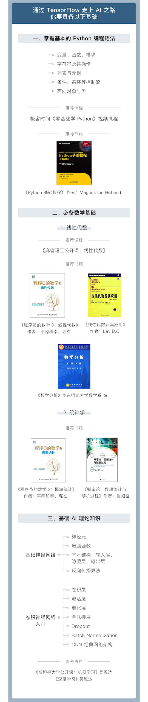

<!-- START doctoc generated TOC please keep comment here to allow auto update -->
<!-- DON'T EDIT THIS SECTION, INSTEAD RE-RUN doctoc TO UPDATE -->
**Table of Contents**  *generated with [DocToc](https://github.com/thlorenz/doctoc)*

- [TensorFlow 快速入门与实战](#tensorflow-%E5%BF%AB%E9%80%9F%E5%85%A5%E9%97%A8%E4%B8%8E%E5%AE%9E%E6%88%98)
  - [课程列表](#%E8%AF%BE%E7%A8%8B%E5%88%97%E8%A1%A8)
      - [第一部分：TensorFlow初印象](#%E7%AC%AC%E4%B8%80%E9%83%A8%E5%88%86tensorflow%E5%88%9D%E5%8D%B0%E8%B1%A1)
      - [第二部分：TensorFlow初接触](#%E7%AC%AC%E4%BA%8C%E9%83%A8%E5%88%86tensorflow%E5%88%9D%E6%8E%A5%E8%A7%A6)
      - [第三部分：TensorFlow基础概念解析](#%E7%AC%AC%E4%B8%89%E9%83%A8%E5%88%86tensorflow%E5%9F%BA%E7%A1%80%E6%A6%82%E5%BF%B5%E8%A7%A3%E6%9E%90)
      - [第四部分：实战TensorFlow房价预测](#%E7%AC%AC%E5%9B%9B%E9%83%A8%E5%88%86%E5%AE%9E%E6%88%98tensorflow%E6%88%BF%E4%BB%B7%E9%A2%84%E6%B5%8B)
      - [第五部分：实战TensorFlow手写体数字识别](#%E7%AC%AC%E4%BA%94%E9%83%A8%E5%88%86%E5%AE%9E%E6%88%98tensorflow%E6%89%8B%E5%86%99%E4%BD%93%E6%95%B0%E5%AD%97%E8%AF%86%E5%88%AB)
      - [第六部分：实战TensorFlow验证码识别](#%E7%AC%AC%E5%85%AD%E9%83%A8%E5%88%86%E5%AE%9E%E6%88%98tensorflow%E9%AA%8C%E8%AF%81%E7%A0%81%E8%AF%86%E5%88%AB)
      - [第七部分：实战TensorFlow人脸识别](#%E7%AC%AC%E4%B8%83%E9%83%A8%E5%88%86%E5%AE%9E%E6%88%98tensorflow%E4%BA%BA%E8%84%B8%E8%AF%86%E5%88%AB)
      - [第八部分：TensorFlow社区参与指南](#%E7%AC%AC%E5%85%AB%E9%83%A8%E5%88%86tensorflow%E7%A4%BE%E5%8C%BA%E5%8F%82%E4%B8%8E%E6%8C%87%E5%8D%97)
  - [问题答疑](#%E9%97%AE%E9%A2%98%E7%AD%94%E7%96%91)
      - [1. Windows 上安装 TensorFlow 流程](#1-windows-%E4%B8%8A%E5%AE%89%E8%A3%85-tensorflow-%E6%B5%81%E7%A8%8B)
      - [2. 学这个课程需要什么样的基础？](#2-%E5%AD%A6%E8%BF%99%E4%B8%AA%E8%AF%BE%E7%A8%8B%E9%9C%80%E8%A6%81%E4%BB%80%E4%B9%88%E6%A0%B7%E7%9A%84%E5%9F%BA%E7%A1%80)

<!-- END doctoc generated TOC please keep comment here to allow auto update -->

# TensorFlow 快速入门与实战


## 交流讨论群


## 课程列表

#### 第一部分：TensorFlow初印象

[课件](beginner/slides/1-TensorFlow初印象.pdf)

#### 第二部分：TensorFlow初接触

[课件](beginner/slides/2-TensorFlow初接触.pdf) | [代码](beginner/notebook-examples/chapter-2)

#### 第三部分：TensorFlow基础概念解析

[课件](beginner/slides/3-TensorFlow基础概念解析.pdf) | [代码](beginner/notebook-examples/chapter-3)

#### 第四部分：实战TensorFlow房价预测

[课件](beginner/slides/4-实战TensorFlow房价预测.pdf) | [代码](beginner/notebook-examples/chapter-4)

#### 第五部分：实战TensorFlow手写体数字识别

[课件](beginner/slides/5-实战TensorFlow手写体数字识别.pdf) | [代码](beginner/notebook-examples/chapter-5)

#### 第六部分：实战TensorFlow验证码识别

[课件](beginner/slides/6-实战TensorFlow验证码识别.pdf) | [代码](beginner/notebook-examples/chapter-6)

#### 第七部分：实战TensorFlow人脸识别

[课件](beginner/slides/7-实战TensorFlow人脸识别.pdf) | [代码](beginner/notebook-examples/chapter-7)

#### 第八部分：TensorFlow社区参与指南

[课件](beginner/slides/8-TensorFlow社区参与指南.pdf)

## 问题答疑

**我将极客时间上多次提到的问题整理在此，希望可以解答有同样问题的朋友。**

#### 1. Windows 上安装 TensorFlow 流程

对于有英文基础的朋友，建议直接阅读官网[安装教程](https://www.tensorflow.org/install/pip?lang=python3)。本答案翻译自 TensorFlow 官网。

系统环境要求：
 - Windows 7（64位) 以上版本
 - Python 3.4, 3.5 或 3.6

Windows 上安装 TensorFlow 步骤：
1. 安装 Python 开发环境

检查系统是否已安装 Python 开发环境。如果已安装，则跳过该步骤。
```shell
python3 --version
pip3 --version
virtualenv --version
```

> 1) 独立安装 Microsoft Visual C++ 2015 Redistributable Update 3 或安装完整的 Visual Studio 2015：
> - 进入 Visual Studio [下载页](https://visualstudio.microsoft.com/vs/older-downloads/)
> - 选择 **Redistributables and Build Tools**
> - 下载和安装 Microsoft Visual C++ 2015 Redistributable Update 3

> 2) 安装 Windows 上 [64位的 Python 3 发布版](https://www.python.org/downloads/windows/)

>  3) 安装 **pip** 和 **virtualenv**
>  ```shell
>  pip3 install -U pip virtualenv
>  ```

2. 创建 Python 虚拟环境

```shell
virtualenv --system-site-packages -p python3 ./venv
.\venv\Scripts\activate
pip install --upgrade pip
pip list  # 展示 venv 中已安装的软件包
deactivate  # 使用完 TensorFlow 后，方可推出 venv 虚拟环境
```

3. 安装 TensorFlow pip 包

```shell
pip install --upgrade tensorflow
python -c "import tensorflow as tf; tf.enable_eager_execution(); print(tf.reduce_sum(tf.random_normal([1000, 1000])))"
```

#### 2. 学这个课程需要什么样的基础？




